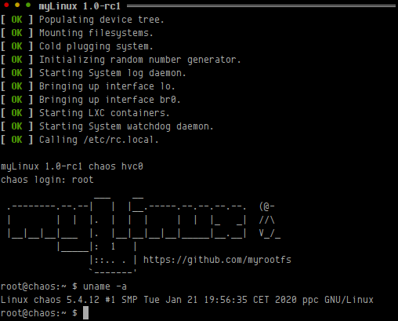
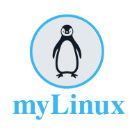

* [Introduction](#introduction)
* [Building](#building)
* [Requirements](#requirements)
* [Qemu Networking](#qemu-networking)
* [Upgrading Linux](#upgrading-linux)
* [Testing SNMP](#testing-snmp)
* [Dropbear SSH](#dropbear-ssh)
* [Using Telnet](#using-telnet)
* [Bugs & Feature Requests](#bugs--feature-requests)
- [Licensing & References](licensing--references)


Introduction
------------

myLinux is a small UNIX like OS for embedded systems.  Clean & vanilla,
with the intent to keep as close to upstream sources as possible.

myLinux can be used to test software components in Qemu before deploying
to an embedded target, or as a reference to other embedded Linux systems.

If you want a small rootfs builder for containers, check [myRootFS][].


Building
--------

To try it out, clone this repository, install the dependencies listed in
the Requirements section, including the toolchain for your preferred
target(s).  There is no default arch, the following are supported:

  * arm
  * arm64
  * ppc
  * x86_64

So, if you want to build for an ARM 64-bit system:

    export PATH=/usr/local/aarch64-unknown-linux-gnu-7.3.0-1/bin:$PATH
    ARCH=arm64 make defconfig
    make -j5

Or modify the configuration, using the well known menuconfig interface:

    make menuconfig
    make -j5

When the build has completed, start Qemu.  Use `root` to login.  
No password by default.

    make run

Online help is available:

    make help

> **Note:** parallel builds (`-j5` above) can be very hard to debug
> since the output of many different components is mixed.  To avoid
> this and maintain your sanity, add `--output-sync=recurse` to
> your `make -jN` commands.


Requirements
------------

The build environment currently requires *at least* the following tools,
tested on Ubuntu 16.04 (x86_64):

```sh
sudo apt install build-essential libssl-dev automake autoconf libtool \
                 pkg-config flex bison wget quilt bc lzop libelf-dev  \
                 gawk device-tree-compiler u-boot-tools               \
                 qemu-system-arm qemu-system-ppc qemu-system-x86
```

Install `libvirt-bin` and `virt-manager` as well, the integration of
these packages in Ubuntu help set up infrastructure such as a `virbr0`
interface on the host for communicating with the Qemu targets.  See more
on this topic below.

You also need cross-compiler toolchains.  The [myRootFS][] project
provides pre-built sysrooted [crosstool-NG][1] based toolchains that
work on most Linux distributions that use the same, or newer, version of
GLIBC as Ubuntu 16.04:

  * [arm-unknown-linux-gnueabi][2]
  * [aarch64-unknown-linux-gnu][3]
  * [powerpc-unknown-linux-gnu][4]
  * [x86_64-unknown-linux-gnu][5]

For x86_64 you may want to enable KVM.  For this to work as a regular
user, add yourself to the kvm group and log out/in again:

    sudo adduser $LOGNAME kvm


Qemu Networking
---------------

myLinux uses Qemu to run the resulting kernel + image.  For networking
to work you can either `sudo make run`, which is a level of access to
your system you likely do not want to give a random Makefile from the
Internet.  Instead you can use capabilities:

    sudo /sbin/setcap cap_net_raw,cap_net_admin+ep /usr/lib/qemu/qemu-bridge-helper
    sudo /sbin/setcap cap_net_raw,cap_net_admin+ep /usr/bin/qemu-system-arm
    sudo /sbin/setcap cap_net_raw,cap_net_admin+ep /usr/bin/qemu-system-aarch64
    ...

Remember, your `$LOGNAME` must be listead  as a known user of both above
capabilities in `/etc/security/capability.conf`.

What remains  now is to  tell Qemu what bridges  in your system  you are
allowed to connect to,  edit/create the file `/etc/qemu/bridge.conf` and
add:

    allow virbr0

Assuming you  have a `virbr0` interface  in your system.  If  you've run
anything in [virt-manager](http://virt-manager.org/)  prior to this then
you're set, otherwise you're unfortunately on your own.


Troubleshooting
---------------

When something does not build it can be hard to see what went wrong, so
there are several shortcuts and other tricks in the build system to help
you.  For instance, verbose mode:

    make V=1

This is  what you are  probably used to  from other build  systems.  But
what if you only want to rebuild a single package?

    make V=1 packages/busybox-build

This builds only BusyBox, with verbose mode enabled.  Other useful
shortcuts are:

    make packages/busybox-clean
    make packages/busybox-distclean
    make packages/busybox-install

To tweak the kernel the following build shortcuts are available:

    make kernel
    make kernel_menuconfig
    make kernel_saveconfig

There are a few more, see the Makefile for details.

> **Note:** debugging Makefiles can be a bit of a hassle.  To see what is
> *really* going on you can used `make --debug=FLAGS V=1`, or even try
> `make SHELL='sh -x' --debug=FLAGS V=1`.  Consult the GNU make man
> page for help with the debug FLAGS.


Upgrading Linux
---------------

Change the Linux kernel version  using `make menuconfig`.  If the kernel
is just a minor patch release, you're done.

If it is a major kernel upgrade, copy the latest `kernel/config-X.YY` to
`kernel/config-X.ZZ` and call `make kernel_oldconfig`.  This will unpack
the kernel and give you a set of questions for all new features.

Make sure to do a `make kernel_saveconfig`, and possibly add the new
`kernel/config-X.ZZ` to GIT.


Testing SNMP
------------

myLinux use [mini-snmpd](https://github.com/troglobit/mini-snmpd) as its
SNMP  agent.  It  is  very  small and  therefore  also  very limited  in
functionality, but it is enough to monitor myLinux by remote if needed.

    initctl enable snmpd
    initctl reload

To test  it you  need an  SNMP client.   The following  command installs
`snmpset`,  `snmpget`,  `snmpwalk`,  base  MIBs and  all  standard  MIBs
needed.  You  may also  be interested in  a more  graphical alternative,
[snmpB](http://sourceforge.net/projects/snmpb/)

<kbd>sudo apt-get install snmp libsnmp-base snmp-mibs-downloader</kbd>

When done you should be able to do the following:

<kbd>snmpwalk -v2c -c public 192.0.2.42</kbd>

    SNMPv2-MIB::sysDescr.0 = STRING: myLinux Linux Virtual Devboard
    SNMPv2-MIB::sysObjectID.0 = OID: SNMPv2-SMI::enterprises
    SNMPv2-MIB::sysUpTime.0 = Timeticks: (465) 0:00:04.65
    SNMPv2-MIB::sysContact.0 = STRING: troglobit@gmail.com
    SNMPv2-MIB::sysName.0 = STRING: chaos
    SNMPv2-MIB::sysLocation.0 = STRING: GitHub
    IF-MIB::ifNumber.0 = INTEGER: 1
    IF-MIB::ifIndex.1 = INTEGER: 1
    IF-MIB::ifDescr.1 = STRING: eth0
    IF-MIB::ifOperStatus.1 = INTEGER: up(1)
    IF-MIB::ifInOctets.1 = Counter32: 5557
    IF-MIB::ifInUcastPkts.1 = Counter32: 45
    IF-MIB::ifInDiscards.1 = Counter32: 0
    IF-MIB::ifInErrors.1 = Counter32: 0
    IF-MIB::ifOutOctets.1 = Counter32: 2958
    IF-MIB::ifOutUcastPkts.1 = Counter32: 19
    IF-MIB::ifOutDiscards.1 = Counter32: 0
    IF-MIB::ifOutErrors.1 = Counter32: 0
    SNMPv2-SMI::mib-2.25.1.1.0 = Timeticks: (71983) 0:11:59.83
    
<kbd>snmpget -c public -v 2c 192.0.2.42 system.sysUpTime.0</kbd>

    SNMPv2-MIB::sysUpTime.0 = Timeticks: (2344) 0:00:23.44


Dropbear SSH
------------

The most common embedded SSH daemon in use on embedded Linux systems
today is [Dropbear](https://matt.ucc.asn.au/dropbear/dropbear.html) by
the incredibly humble [Matt Johnston](https://matt.ucc.asn.au/).

No services are enabled by default in myLinux, so Dropbear has to be
enabled first.  It currently allows `root` access, but we recommend
disabling this and set up another user: <kbd>adduser example</kbd>

    initctl enable sshd
    initctl reload

Test SSH from your host simply by: <kbd>ssh example@192.0.2.42</kbd>


Using Telnet
------------

The Busybox `telnetd` is available in myLinux, but you have to enable
the service to start it:

    initctl enable telnetd
    initctl reload

Test it from your host by simply calling <kbd>telnet 192.0.2.42</kbd>


Bugs & Feature Requests
-----------------------

Feel free to report bugs and request features, or even submit your own
[pull requests](https://help.github.com/articles/using-pull-requests/)
using [GitHub](https://github.com/myrootfs/myLinux)


Licensing & References
----------------------

With the exceptions listed below, myLinux is distributed under the terms
of the [ISC License][]¹.  myLinux is the build system, or glue, that
ties the various Open Source components together.  Some files have a
different license statement, e.g. kconfig.  Those files are licensed
under the license contained in the file itself.

myrootfs bundles patch files, which are applied to the sources of the
various Open Source packages.  Those patches are not covered by the
license of myrootfs.  Instead, they are covered by the license of the
software to which the patches are applied, when said software comes
available under multiple licenses, sometimes as alternative commercial
licenses, the patches are provided under the publicly available Open
Source licenses.

----
> ¹ *"... functionally equivalent to the [simplified BSD][] and [MIT][]
>    licenses, but without language deemed unnecessary following the
>    [Berne Convention][]."*  --[Theo de Raadt][]

[1]: https://github.com/crosstool-ng/crosstool-ng/releases
[2]: https://github.com/myrootfs/crosstool-ng/releases/download/troglobit%2F7.3.0-1/arm-unknown-linux-gnueabi-7.3.0-1.tar.xz
[3]: https://github.com/myrootfs/crosstool-ng/releases/download/troglobit%2F7.3.0-1/aarch64-unknown-linux-gnu-7.3.0-1.tar.xz
[4]: https://github.com/myrootfs/crosstool-ng/releases/download/troglobit%2F7.3.0-1/powerpc-unknown-linux-gnu-7.3.0-1.tar.xz
[5]: https://github.com/myrootfs/crosstool-ng/releases/download/troglobit%2F7.3.0-1/x86_64-unknown-linux-gnu-7.3.0-1.tar.xz
[myRootFS]: https://github.com/myrootfs/myrootfs
[simplified BSD]:   https://en.wikipedia.org/wiki/BSD_licenses#2-clause
[MIT]:              https://en.wikipedia.org/wiki/MIT_License
[Berne Convention]: https://en.wikipedia.org/wiki/Berne_Convention
[Theo de Raadt]:    https://marc.info/?l=openbsd-misc&m=120618313520730&w=2
[ISC License]: https://en.wikipedia.org/wiki/ISC_license
