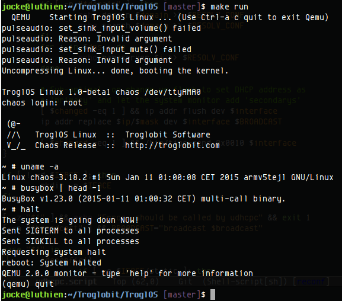

``` 
                           __                                   ______
  _______                 |  |_______ _______       .-------.  /\     \
 |       .----.-----.-----|  |   _   |   _   |     /   o   /| /o \  o  \
 |.|   | |   _|  _  |  _  |  |.  |   |   1___|    /_______/o|/   o\_____\
 `-|.  |-|__| |_____|___  |__|.  |   |____   |    | o     | |\o   /o    /
   |:  |            |_____|  |:  1   |:  1   |    |   o   |o/ \ o/  o  /
   |::.|                     |::.. . |::.. . |    |     o |/   \/____o/
   `---'                     `-------`-------'    '-------'
```


* [Introduction](#introduction)
* [Building](#building)
* [Requirements](#requirements)
* [Qemu Networking](#qemu-networking)
* [Upgrading Linux](#upgrading-linux)
* [Testing SNMP](#testing-snmp)
* [Dropbear SSH](#dropbear-ssh)
* [Using Telnet](#using-telnet)
* [Bugs & Feature Requests](#bugs--feature-requests)


Introduction
------------

TroglOS is  a playful, but working,  example of how to  create a virtual
devboard from components like Qemu, Linux  and BusyBox.  It can also run
on actual HW, currently Raspberry Pi.

Use the  build framework in  TroglOS to test your  embedded applications
before the actual hardware arrives.  Or  as a stable reference when said
hardware starts acting up -- as it  invariably does ... you can even use
it as  a reference to  other embedded  Linux build systems.   TroglOS is
relatively  clean and  vanilla, the  intent is  to keep  it as  close to
upstream sources as possible.

Currently TroglOS supports  an *ARM Versatile PB* devboard  with Qemu, a
Freescale e500 PowerPC, also with Qemu, and Raspberry Pi 2, BCM2836.  It
has only been  tested on a Ubuntu 64-bit host,  with a [crosstool-NG][1]
based [toolchain][2].  Pull requests for  more targets are most welcome!
:)


Building
--------

To try it out, simply clone this repository, install the dependencies
listed in the Requirements section, then type:

    make

Or modify the configuration using the well known menuconfig interface

    make menuconfig
    make

When the build has completed, start Qemu.  Use `root` to login.  
No password by default.

    make run

For a truly minimal setup, only Busybox and an ARM/Versatile config:

    make distclean
    cp small.config .config && make oldconfig
    make
    make run

As an alternative, which can be useful for scripting, the menuconfig
step can be skipped using an arch-specific defconfig:

    make distclean
    ARCH=ppc make ppce500_defconfig
    make
    make run

Now go have fun! :-)


Requirements
------------

The build environment currently requires at least the following tools,
tested on Ubuntu 16.04 (x86_64):

* build-essential (gcc, make, etc.) libssl-dev (to build kernel)
* automake autoconf libtool pkg-config flex bison wget quilt
* bc lzop device-tree-compiler (arm + powerpc) u-boot-tools (mkimage)
* libelf-dev (x86)
* qemu-system-arm (install libvirt-bin and virt-manager as well!)
* Toolchains, which requires gawk:
  * [arm-unknown-linux-gnueabi][2]
  * [aarch64-unknown-linux-gnu][2]
  * [powerpc-unknown-linux-gnu][2]
  * [x86_64-unknown-linux-gnu][2]
* probably more, gzip?

For x86_64 you may want to enable KVM.  For this to work as a regular
user, add yourself to the kvm group and log out/in again:

    sudo adduser $LOGNAME kvm


Qemu Networking
---------------

TroglOS uses Qemu to run the resulting kernel + image.  For networking
to work you can either `sudo make run`, which is a level of access to
your system you likely do not want to give a random Makefile from the
Internet.  Instead you can use capabilities:

    sudo /sbin/setcap cap_net_raw,cap_net_admin+ep /usr/lib/qemu/qemu-bridge-helper
    sudo /sbin/setcap cap_net_raw,cap_net_admin+ep /usr/bin/qemu-system-arm
    sudo /sbin/setcap cap_net_raw,cap_net_admin+ep /usr/bin/qemu-system-aarch64
    ...

Remember, your `$LOGNAME` must be listead  as a known user of both above
capabilities in `/etc/security/capability.conf`.

What remains  now is to  tell Qemu what bridges  in your system  you are
allowed to connect to,  edit/create the file `/etc/qemu/bridge.conf` and
add:

    allow virbr0

Assuming you  have a `virbr0` interface  in your system.  If  you've run
anything in [virt-manager](http://virt-manager.org/)  prior to this then
you're set, otherwise you're unfortunately on your own.


Troubleshooting
---------------

TroglOS builds silent.   You will not see any  compiler output, warnings
or such by  default.  When something does not work  this can be slightly
annoying, so there are several shortcuts and other tricks to help you!

First,  check  the file  `build.log`,  everything  is redirected  there,
except for  some status messages.  If  that does not help,  try enabling
verbose mode:

    make V=1

This is  what you are  probably used to  from other build  systems.  But
what if you only want to rebuild a single package?

    make V=1 packages/busybox-build

This builds only BusyBox, with verbose mode enabled.  Other useful
shortcuts are:

    make packages/busybox-clean
    make packages/busybox-distclean
    make packages/busybox-install

To tweak the kernel the following build shortcuts are available:

    make kernel
    make kernel_menuconfig
    make kernel_saveconfig

There are a few more, see the Makefile for details, it is surprisingly
readable! :-)


Upgrading Linux
---------------

Change the Linux kernel version  using `make menuconfig`.  If the kernel
is just a minor patch release, you're done.

If it is a major kernel upgrade, copy the latest `kernel/config-X.YY` to
`kernel/config-X.ZZ` and call `make kernel_oldconfig`.  This will unpack
the kernel and give you a set of questions for all new features.

Make sure to do a `make kernel_saveconfig`, and possibly add the new
`kernel/config-X.ZZ` to GIT.


Testing SNMP
------------

TroglOS use [mini-snmpd](https://github.com/troglobit/mini-snmpd) as its
SNMP  agent.  It  is  very  small and  therefore  also  very limited  in
functionality, but it is enough to monitor TroglOS by remote if needed.

    initctl enable snmpd
    initctl reload

To test  it you  need an  SNMP client.   The following  command installs
`snmpset`,  `snmpget`,  `snmpwalk`,  base  MIBs and  all  standard  MIBs
needed.  You  may also  be interested in  a more  graphical alternative,
[snmpB](http://sourceforge.net/projects/snmpb/)

<kbd>sudo apt-get install snmp libsnmp-base snmp-mibs-downloader</kbd>

When done you should be able to do the following:

<kbd>snmpwalk -v2c -c public 192.0.2.42</kbd>

    SNMPv2-MIB::sysDescr.0 = STRING: TroglOS Linux Virtual Devboard
    SNMPv2-MIB::sysObjectID.0 = OID: SNMPv2-SMI::enterprises
    SNMPv2-MIB::sysUpTime.0 = Timeticks: (465) 0:00:04.65
    SNMPv2-MIB::sysContact.0 = STRING: troglobit@gmail.com
    SNMPv2-MIB::sysName.0 = STRING: chaos
    SNMPv2-MIB::sysLocation.0 = STRING: GitHub
    IF-MIB::ifNumber.0 = INTEGER: 1
    IF-MIB::ifIndex.1 = INTEGER: 1
    IF-MIB::ifDescr.1 = STRING: eth0
    IF-MIB::ifOperStatus.1 = INTEGER: up(1)
    IF-MIB::ifInOctets.1 = Counter32: 5557
    IF-MIB::ifInUcastPkts.1 = Counter32: 45
    IF-MIB::ifInDiscards.1 = Counter32: 0
    IF-MIB::ifInErrors.1 = Counter32: 0
    IF-MIB::ifOutOctets.1 = Counter32: 2958
    IF-MIB::ifOutUcastPkts.1 = Counter32: 19
    IF-MIB::ifOutDiscards.1 = Counter32: 0
    IF-MIB::ifOutErrors.1 = Counter32: 0
    SNMPv2-SMI::mib-2.25.1.1.0 = Timeticks: (71983) 0:11:59.83
    
<kbd>snmpget -c public -v 2c 192.0.2.42 system.sysUpTime.0</kbd>

    SNMPv2-MIB::sysUpTime.0 = Timeticks: (2344) 0:00:23.44


Dropbear SSH
------------

The most common embedded SSH daemon in use on embedded Linux systems
today is [Dropbear](https://matt.ucc.asn.au/dropbear/dropbear.html) by
the incredibly humble [Matt Johnston](https://matt.ucc.asn.au/).

No services are enabled by default in TroglOS, so Dropbear has to be
enabled first.  It currently allows `root` access, but we recommend
disabling this and set up another user: <kbd>adduser example</kbd>

    initctl enable sshd
    initctl reload

Test SSH from your host simply by: <kbd>ssh example@192.0.2.42</kbd>


Using Telnet
------------

The Busybox `telnetd` is available in TroglOS, but you have to enable
the service to start it:

    initctl enable telnetd
    initctl reload

Test it from your host by simply calling <kbd>telnet 192.0.2.42</kbd>


Bugs & Feature Requests
-----------------------

Feel free to report bugs and request features, or even submit your own
[pull requests](https://help.github.com/articles/using-pull-requests/)
using [GitHub](https://github.com/troglobit/troglos)

Cheers!  
-- Joachim

[1]: https://github.com/crosstool-ng/crosstool-ng
[2]: http://ftp.troglobit.com/pub/Toolchains/arm-unknown-linux-gnueabi-7.3.0-1.tar.xz
